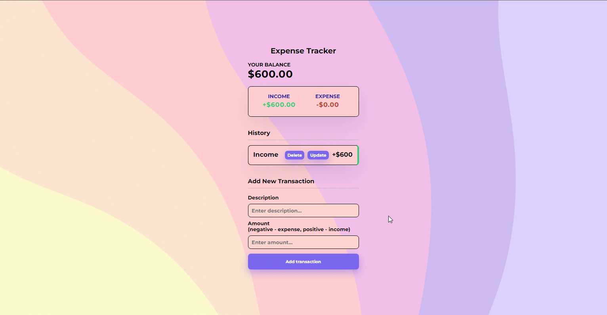

# Expense Tracker using React Context API and TypeScript


## Setup

- Clone this repository:
```bash
git clone https://github.com/SaadFarhanIdress/expense-tracker-ts-mern
```
- Go to root directory of repository and install dependencies:
```bash 
cd expense-tracker-ts-mern
npm install
cd client 
npm install
cd ..
```
- Running Scripts
```bash
# Run front and backend
npm run dev
 
# Backend only
npm run server
 
# Frontend only
npm run client
 
# Build client
cd client
npm run build

# Prod
npm start
```