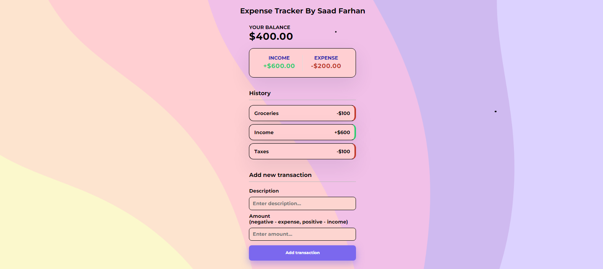

# Expense Tracker using React Context API & TypeScript

## [Live Site](https://expense-tracker-by-saad-farhan.surge.sh)


## Setup
- Clone repository:
```bash
    git clone https://github.com/SaadFarhanIdress/expense-tracker-ts-mern
```
- Go to root directory:
```bash
cd expense-tracker-ts-mern
```
- Install dependencies of server:
```bash
cd server && npm i 
# OR
cd server && yarn
```
- Add `MONGODB_URI` environment variable to the `.env` file:
```

```
- Install 